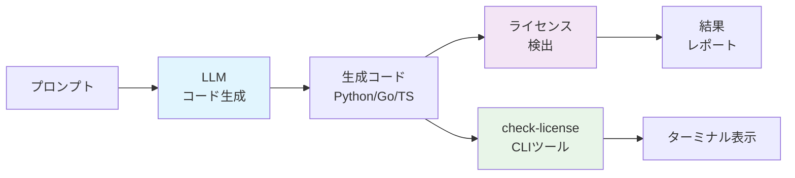
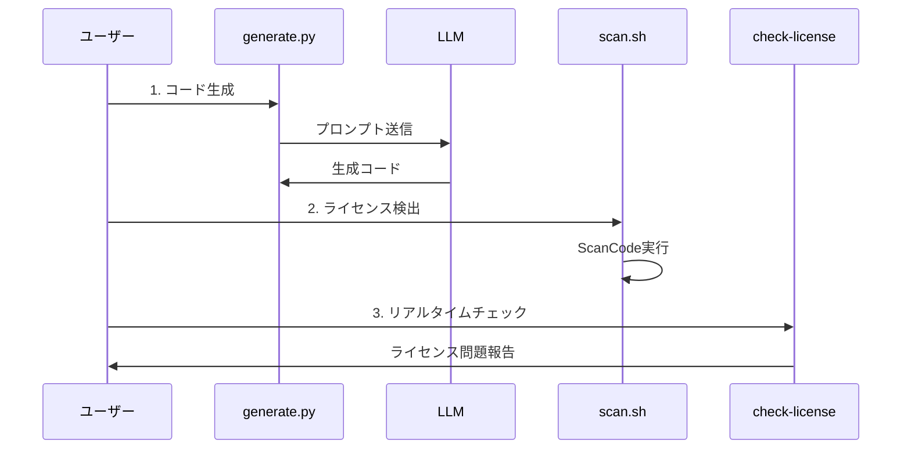
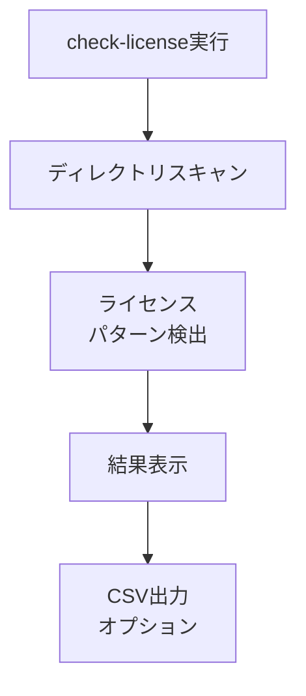

# LLM生成コードのライセンスチェック実験

生成AI（GPT-4o / Claude-3 Opus）が出力したコードにOSSライセンス由来の断片が混入していないかを定量的に検証するためのツールです。

## システムアーキテクチャ



## プロジェクト構成

```
licence-check/
├── .env                    # API キー設定（.env.templateからコピー）
├── .env.template          # API キー設定テンプレート
├── prompts/
│   └── prompt_spec.yaml   # プロンプト仕様
├── generated/             # 生成されたコード
│   ├── python/
│   ├── go/
│   └── typescript/
├── scans/
│   └── scancode_output/   # ScanCodeの結果
├── scripts/
│   ├── 01_generate.py     # コード生成
│   ├── 02_scan.sh         # ライセンス検出
│   ├── 03_similarity.py   # 類似度チェック
│   └── 04_aggregate.py    # 結果集計
├── results.sqlite         # 結果データベース
└── README.md
```

## セットアップ

### 必要な環境

- Python 3.11+
- Docker 24.x
- SQLite3 3.39+
- Ollama（ローカルLLM使用時）

### 依存関係のインストール

```bash
# Python パッケージ
pip install openai anthropic pyyaml pandas python-dotenv requests

# オプション: 類似度チェック用（現在は基本実装で代替）
# pip install oss-detective

# Ruby gem（オプション）
gem install licensee
```

### ローカルLLMのセットアップ（推奨）

#### 1. Ollamaのインストール

```bash
# macOS / Linux
curl -fsSL https://ollama.ai/install.sh | sh

# または Homebrew（macOS）
brew install ollama
```

#### 2. 推奨モデルのダウンロード

```bash
# Ollamaサーバーを起動
ollama serve

# 別のターミナルで
# 汎用言語モデル（軽量）
ollama pull llama2:7b

# コード生成特化モデル（軽量）
ollama pull codegemma:2b

# その他の選択肢
# ollama pull codellama:7b        # より大きなコード生成モデル
# ollama pull deepseek-coder:6.7b # 高性能コード生成モデル
# ollama pull mistral:7b          # 汎用モデル
```

#### 3. モデルの確認

```bash
ollama list
```

### API キーの設定

#### ローカルLLM使用の場合（推奨）

```bash
cp .env.template .env
```

`.env`ファイルを編集：
```bash
# ローカルLLMを使用
USE_LOCAL_LLM=true
OLLAMA_BASE_URL=http://localhost:11434
LOCAL_MODEL_1=llama2:7b
LOCAL_MODEL_2=codegemma:2b
```

#### クラウドAPI使用の場合

```bash
cp .env.template .env
```

`.env`ファイルを編集：
```bash
# クラウドAPIを使用
USE_LOCAL_LLM=false
OPENAI_API_KEY=your_openai_api_key_here
ANTHROPIC_API_KEY=your_anthropic_api_key_here
```

## 使用方法

### 前提条件

#### ローカルLLM使用の場合
1. Ollamaサーバーが起動していることを確認
```bash
ollama serve
```

2. モデルがダウンロード済みであることを確認
```bash
ollama list
```

### 1. コード生成

```bash
cd /Users/kazuki-k/licence-check
python scripts/01_generate.py
```

**ローカルLLM使用時の特徴：**
- 各言語（Python, Go, TypeScript）で30個ずつのTODOマネージャーコードを生成
- 設定された2つのモデルが交互に使用される
- API費用不要、プライバシー保護
- 初回は生成に時間がかかる場合があります（モデルサイズによる）

**クラウドAPI使用時の特徴：**
- OpenAI GPT-4o-miniとClaude-3 Opusが交互に使用される
- 高品質なコード生成
- API利用料金が発生

### 2. ライセンス検出

```bash
./scripts/02_scan.sh
```

ScanCode ToolkitのDockerイメージを使用してライセンス検出を実行します。

### 3. 類似度チェック（オプション）

```bash
python scripts/03_similarity.py
```

oss-detectiveを使用してOSSコードとの類似度をチェックします。

### 4. 結果集計

```bash
python scripts/04_aggregate.py
```

結果をSQLiteデータベースに集計し、CSVレポートを生成します。

## 出力ファイル

- `results.sqlite`: 全結果データ
- `scans/license_summary.csv`: ライセンス検出結果サマリー
- `scans/similarity_summary.csv`: 類似度分析サマリー（オプション）

## 倫理・注意点

- OSS本体の長文コードを記事に転載しない
- 実験結果はモデル更新で変わる可能性があるため日付を明記
- 検出ツールの誤検知/漏れを踏まえ「100%安全とは言えない」旨を記載

## トラブルシューティング

### ローカルLLM関連
- **Ollamaサーバーが起動しない**: `ollama serve` コマンドでサーバーを起動
- **モデルが見つからない**: `ollama list` で確認、必要に応じて `ollama pull <model>` でダウンロード
- **生成が遅い**: モデルサイズが大きい場合は時間がかかります。軽量モデル（2b, 7b）の使用を推奨
- **メモリ不足**: より小さなモデルを使用するか、`LOCAL_MODEL_1=llama2:7b` を `LOCAL_MODEL_1=codegemma:2b` に変更

### Docker関連
- Dockerが起動していることを確認
- 十分なディスク容量があることを確認
- ARM64プラットフォーム（Apple Silicon）では `--platform linux/amd64` を自動で使用

### API関連
- API キーが正しく設定されていることを確認
- レート制限に注意（スクリプトには1秒の待機時間を設定済み）
- `.env` ファイルが正しく読み込まれているか確認

### 依存関係
- `python-dotenv` がインストールされていることを確認: `pip install python-dotenv`
- ScanCodeが正常に動作しない場合はDockerの設定を確認
- 類似度チェックは基本実装を使用（高度な機能が必要な場合は専門ツールを検討）

### 環境変数が読み込まれない場合
```bash
# 手動で環境変数を設定
export USE_LOCAL_LLM=true
export LOCAL_MODEL_1=llama2:7b
export LOCAL_MODEL_2=codegemma:2b
python scripts/01_generate.py
```

## ライセンスチェックCLIツール

### インストール

```bash
# グローバルインストール（推奨）
./install.sh

# または直接実行
./check-license
```

### 使用方法

```bash
# 基本的な使用方法
check-license                    # カレントディレクトリをスキャン

# オプション
check-license --summary-only     # サマリーのみ表示
check-license --verbose          # 詳細な内容を表示
check-license --ignore node_modules,dist  # 特定のディレクトリを無視
check-license --output report.csv # 結果をCSVファイルに保存
check-license --help             # ヘルプを表示
```

### 特徴

- **再帰的スキャン**: ディレクトリ階層を最後まで探索
- **ライセンス検出**: 著作権表示、ライセンステキスト、SPDX識別子を検出
- **重要度判定**: CRITICAL、HIGH、MEDIUM、LOWで問題を分類
- **カラー出力**: ターミナルで見やすい色付き表示
- **CSV出力**: 詳細レポートをCSV形式で保存
- **除外機能**: node_modules、.git等の不要なディレクトリを自動除外

### 検出される問題タイプ

**CRITICAL (重要):**
- SPDX ライセンス識別子
- MIT/Apache/GPL ライセンステキスト

**HIGH (高):**
- 著作権表示
- 権利留保条項

**MEDIUM (中):**
- 外部ソース参照
- AI生成通知

**LOW (低):**
- LLM出力フォーマット
- コードブロックマーカー

### 終了コード

- `0`: 問題なし
- `1`: 非重要な問題あり
- `2`: 重要な問題あり（CRITICAL）

## 実行フロー



### CLIツール動作



## 主要コンポーネント

| コンポーネント | 役割 | 技術スタック |
|---------------|-----|-------------|
| **01_generate.py** | LLMコード生成 | Ollama/OpenAI/Claude API |
| **02_scan.sh** | ライセンス検出 | ScanCode Toolkit (Docker) |
| **03_similarity.py** | 類似度分析 | ハッシュ比較・パターンマッチ |
| **04_aggregate.py** | 結果集計 | pandas + SQLite |
| **05_detailed_report.py** | 詳細レポート生成 | SQLite + CSV出力 |
| **check-license** | リアルタイムCLI | Python + 正規表現 |
| **results.sqlite** | データ永続化 | SQLite データベース |

## 検出項目

### ライセンス関連
- **CRITICAL**: MIT/Apache/GPL ライセンステキスト、SPDX識別子
- **HIGH**: 著作権表示、権利留保条項
- **MEDIUM**: 外部ソース参照、AI生成通知
- **LOW**: LLM出力フォーマット残存