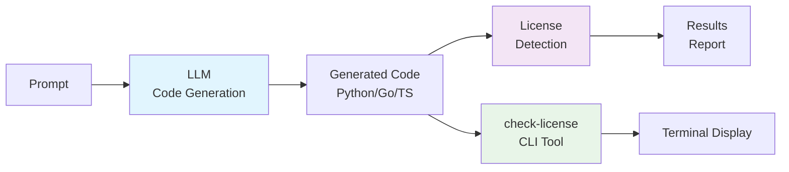
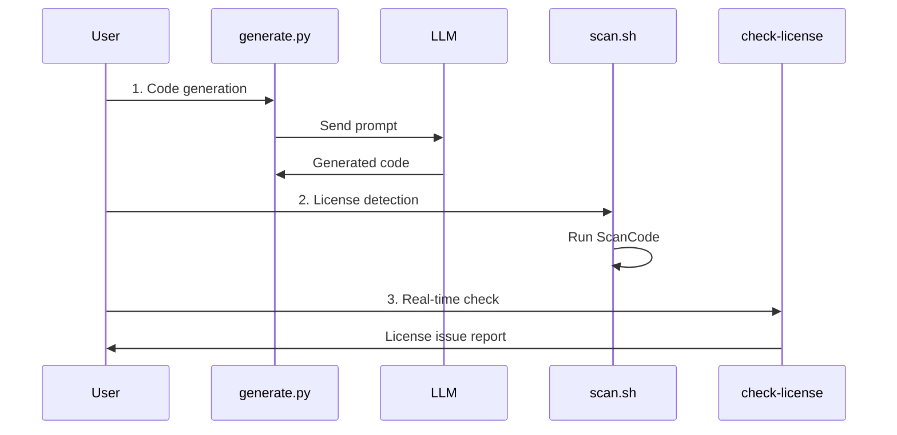
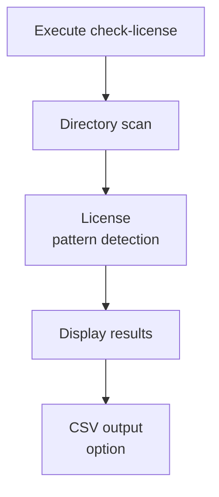

# License Check Experiment for LLM-Generated Code

A tool for quantitatively verifying whether code generated by AI (GPT-4o / Claude-3 Opus) contains OSS license-derived fragments.

## System Architecture



## Project Structure

```
licence-check/
├── .env                    # API key configuration (copy from .env.template)
├── .env.template          # API key configuration template
├── prompts/
│   └── prompt_spec.yaml   # Prompt specifications
├── generated/             # Generated code
│   ├── python/
│   ├── go/
│   └── typescript/
├── scans/
│   └── scancode_output/   # ScanCode results
├── scripts/
│   ├── 01_generate.py     # Code generation
│   ├── 02_scan.sh         # License detection
│   ├── 03_similarity.py   # Similarity check
│   └── 04_aggregate.py    # Result aggregation
├── results.sqlite         # Results database
└── README.md
```

## Setup

### Requirements

- Python 3.11+
- Docker 24.x
- SQLite3 3.39+
- Ollama (for local LLM usage)

### Install Dependencies

```bash
# Python packages
pip install openai anthropic pyyaml pandas python-dotenv requests

# Optional: For similarity checking (currently replaced with basic implementation)
# pip install oss-detective

# Ruby gem (optional)
gem install licensee
```

### Local LLM Setup (Recommended)

#### 1. Install Ollama

```bash
# macOS / Linux
curl -fsSL https://ollama.ai/install.sh | sh

# Or via Homebrew (macOS)
brew install ollama
```

#### 2. Download Recommended Models

```bash
# Start Ollama server
ollama serve

# In another terminal
# General language model (lightweight)
ollama pull llama2:7b

# Code generation specialized model (lightweight)
ollama pull codegemma:2b

# Other options
# ollama pull codellama:7b        # Larger code generation model
# ollama pull deepseek-coder:6.7b # High-performance code generation model
# ollama pull mistral:7b          # General purpose model
```

#### 3. Verify Models

```bash
ollama list
```

### API Key Configuration

#### For Local LLM Usage (Recommended)

```bash
cp .env.template .env
```

Edit the `.env` file:
```bash
# Use local LLM
USE_LOCAL_LLM=true
OLLAMA_BASE_URL=http://localhost:11434
LOCAL_MODEL_1=llama2:7b
LOCAL_MODEL_2=codegemma:2b
```

#### For Cloud API Usage

```bash
cp .env.template .env
```

Edit the `.env` file:
```bash
# Use cloud APIs
USE_LOCAL_LLM=false
OPENAI_API_KEY=your_openai_api_key_here
ANTHROPIC_API_KEY=your_anthropic_api_key_here
```

## Usage

### Prerequisites

#### For Local LLM Usage
1. Ensure Ollama server is running
```bash
ollama serve
```

2. Verify models are downloaded
```bash
ollama list
```

### 1. Code Generation

```bash
cd /Users/kazuki-k/licence-check
python scripts/01_generate.py
```

**Local LLM Features:**
- Generates 30 TODO manager codes each for Python, Go, and TypeScript
- Two configured models are used alternately
- No API costs, privacy protection
- Initial generation may take time (depending on model size)

**Cloud API Features:**
- OpenAI GPT-4o-mini and Claude-3 Opus are used alternately
- High-quality code generation
- API usage fees apply

### 2. License Detection

```bash
./scripts/02_scan.sh
```

Performs license detection using ScanCode Toolkit Docker image.

### 3. Similarity Check (Optional)

```bash
python scripts/03_similarity.py
```

Checks similarity with OSS code using oss-detective.

### 4. Result Aggregation

```bash
python scripts/04_aggregate.py
```

Aggregates results into SQLite database and generates CSV reports.

## Output Files

- `results.sqlite`: Complete results data
- `scans/license_summary.csv`: License detection results summary
- `scans/similarity_summary.csv`: Similarity analysis summary (optional)

## Ethics & Considerations

- Do not republish long OSS code in articles
- Experimental results may change with model updates, so include dates
- Note that detection tools may have false positives/negatives, stating "cannot guarantee 100% safety"

## Troubleshooting

### Local LLM Related
- **Ollama server won't start**: Start server with `ollama serve` command
- **Model not found**: Check with `ollama list`, download with `ollama pull <model>` if needed
- **Slow generation**: Large models take time. Recommend lightweight models (2b, 7b)
- **Memory shortage**: Use smaller models or change `LOCAL_MODEL_1=llama2:7b` to `LOCAL_MODEL_1=codegemma:2b`

### Docker Related
- Ensure Docker is running
- Verify sufficient disk space
- ARM64 platforms (Apple Silicon) automatically use `--platform linux/amd64`

### API Related
- Verify API keys are correctly configured
- Be aware of rate limits (scripts include 1-second wait times)
- Ensure `.env` file is properly loaded

### Dependencies
- Ensure `python-dotenv` is installed: `pip install python-dotenv`
- If ScanCode doesn't work properly, check Docker configuration
- Similarity check uses basic implementation (consider specialized tools for advanced features)

### Environment Variables Not Loading
```bash
# Manually set environment variables
export USE_LOCAL_LLM=true
export LOCAL_MODEL_1=llama2:7b
export LOCAL_MODEL_2=codegemma:2b
python scripts/01_generate.py
```

## License Check CLI Tool

### Installation

```bash
# Global installation (recommended)
./install.sh

# Or direct execution
./check-license
```

### Usage

```bash
# Basic usage
check-license                    # Scan current directory

# Options
check-license --summary-only     # Show summary only
check-license --verbose          # Show detailed content
check-license --ignore node_modules,dist  # Ignore specific directories
check-license --output report.csv # Save results to CSV file
check-license --version          # Show tool version
check-license --help             # Show help
```

### Features

- **Recursive Scanning**: Explores directory hierarchy completely
- **License Detection**: Detects copyright notices, license texts, SPDX identifiers
- **Severity Assessment**: Classifies issues as CRITICAL, HIGH, MEDIUM, LOW
- **Color Output**: Easy-to-read colored terminal display
- **CSV Output**: Save detailed reports in CSV format
- **Exclusion Features**: Automatically excludes unnecessary directories like node_modules, .git

### Detected Issue Types

**CRITICAL (Critical):**
- SPDX license identifiers
- MIT/Apache/GPL license texts

**HIGH (High):**
- Copyright notices
- Rights reservation clauses

**MEDIUM (Medium):**
- External source references
- AI generation notices

**LOW (Low):**
- LLM output formatting
- Code block markers

### Exit Codes

- `0`: No issues
- `1`: Non-critical issues present
- `2`: Critical issues present (CRITICAL)

## Execution Flow



### CLI Tool Operation



## Key Components

| Component | Role | Tech Stack |
|-----------|------|------------|
| **01_generate.py** | LLM code generation | Ollama/OpenAI/Claude API |
| **02_scan.sh** | License detection | ScanCode Toolkit (Docker) |
| **03_similarity.py** | Similarity analysis | Hash comparison & pattern matching |
| **04_aggregate.py** | Result aggregation | pandas + SQLite |
| **05_detailed_report.py** | Detailed report generation | SQLite + CSV output |
| **check-license** | Real-time CLI | Python + regex |
| **results.sqlite** | Data persistence | SQLite database |

## Detection Items

### License Related
- **CRITICAL**: MIT/Apache/GPL license texts, SPDX identifiers
- **HIGH**: Copyright notices, rights reservation clauses
- **MEDIUM**: External source references, AI generation notices
- **LOW**: Remaining LLM output formatting